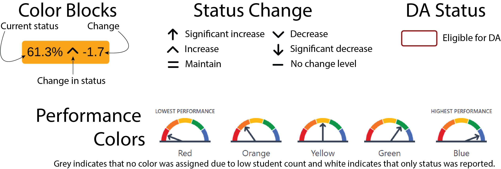

```{r setup}
#| include = FALSE

library(tidyverse)
library(DT)
library(wesanderson)
library(fontawesome)
library(ggtext)
library(showtext)
library(flextable)
library(here)

if (interactive()) {
  params <- rmarkdown::yaml_front_matter(
    rstudioapi::getSourceEditorContext()$path
  )$params
}

essa <- read_csv(here("data/dashboard_essa.csv")) |>
  janitor::clean_names() |>
  filter(countyname == "Solano", rtype == "S") |>
  mutate(
    color = as_factor(color),
    student_group_long = fct_relevel(
      as_factor(student_group_long),
      "All students",
      "American Indian or Alaska Native",
      "Asian",
      "Black/African American",
      "Filipino",
      "Hispanic",
      "Pacific Islander",
      "White",
      "Multiple Races/Two or more",
      "Socioeconomically Disadvantaged",
      "Homeless Youth",
      "Students with Disabilities",
      "Foster Youth",
      "English Learner",
      "English Learners Only",
      "Long-Term English Learner",
      "RFEPs Only",
      "English Only",
      "Smarter Balanced Assessment",
      "CA Alternative Assessment"
    ),
    indicator = fct_relevel(
      as_factor(indicator),
      "ELA",
      "Math",
      "ELPI",
      "absenteeism",
      "graduation",
      "suspension"
    )
  )

status_colors <- c(
  "lightgrey",
  "tomato",
  "orange",
  "yellow",
  "mediumseagreen",
  "dodgerblue",
  "darkgrey"
)

font_add('fa-solid', here('fonts/fa-solid-900.ttf'))

# element_markdown uses <br> for newlines
html_wrap <- function(s, width = 17) {
  str_wrap(s, width = width) |>
    str_replace_all("\n", "<br>")
}

essa_filtered <-
  essa |>
  filter(
    schoolname == params$school,
    reportingyear == params$year,
    student_group_long %in%
      c(
        "All students",
        "American Indian or Alaska Native",
        "Asian",
        "Black/African American",
        "Filipino",
        "Hispanic",
        "Pacific Islander",
        "White",
        "Multiple Races/Two or more",
        "Socioeconomically Disadvantaged",
        "Homeless Youth",
        "Students with Disabilities",
        "Foster Youth",
        "English Learner",
        "Long-Term English Learner"
      )
  ) |>
  mutate(
    student_group_wrapped = html_wrap(student_group_long, width = 17),
    change = if_else(is.na(change), "", paste(change)),
    change_arrow = if_else(
      indicator %in%
        c(
          "ELA",
          "Math",
          "ELPI",
          "graduation",
          "college/career"
        ),
      case_match(
        changelevel,
        0 ~ "<span style='font-family:fa-solid;'>&#xf068;</span>",
        1 ~ "<span style='font-family:fa-solid;'>&#xf063;</span>",
        2 ~ "<span style='font-family:fa-solid;'>&#xf078;</span>",
        3 ~ "<span style='font-family:fa-solid;'>&#xf7a4;</span>",
        4 ~ "<span style='font-family:fa-solid;'>&#xf077;</span>",
        5 ~ "<span style='font-family:fa-solid;'>&#xf062;</span>",
        .default = "<span>&nbsp;&nbsp;&nbsp;&nbsp;&nbsp;&nbsp;&nbsp;</span>"
      ),
      case_match(
        changelevel,
        0 ~ "<span style='font-family:fa-solid;'>&#xf068;</span>",
        5 ~ "<span style='font-family:fa-solid;'>&#xf063;</span>",
        4 ~ "<span style='font-family:fa-solid;'>&#xf078;</span>",
        3 ~ "<span style='font-family:fa-solid;'>&#xf7a4;</span>",
        2 ~ "<span style='font-family:fa-solid;'>&#xf077;</span>",
        1 ~ "<span style='font-family:fa-solid;'>&#xf062;</span>",
        .default = "<span>&nbsp;&nbsp;&nbsp;&nbsp;&nbsp;&nbsp;&nbsp;</span>"
      )
    )
  ) |>
  arrange(student_group_long)

group_count <-
  essa_filtered |>
  select(student_group_long) |>
  unique() |>
  nrow()

group_order <-
  essa_filtered |>
  select(student_group_long) |>
  unique() |>
  arrange(student_group_long) |>
  mutate(order = c(1:group_count))

```

{fig-align="right" width="127"}

# `r params$school` Comprehensive Support and Improvement Report `r paste0(params$year, "-", params$year + 1)`

## Comprehensive Support and Improvement (CSI) Eligibility

In accordance with Every Student Succeeds Act [(ESSA)](https://www.cde.ca.gov/re/es/), schools are eligible for CSI if they receive at least one color coded performance level on any state indicator and meet the criteria in one of the following categories:

1.  CSI--Low Graduation Rate For `r params$year`.

2.  CSI--Low Performing For `r params$year`.

The complete details for determining eligibility can be found in the technical guide for CSI released by the CA Department of Education (CDE). [Download the technical guide here.](https://www.cde.ca.gov/sp/sw/t1/csi.asp)

ESSA support determinations under CSI were made for California following the publication of the 2023 Dashboard. These determinations marked the first year of California’s three-year identification cycle. Schools eligible for CSI (Low Graduation Rate/Low Performing) in 2023–24 have been evaluated annually to determine continued eligibility for CSI and entry determinations for Targeted Support and Improvement (TSI). The 2025 Dashboard results represent the third year of California's three year cycle.

```{r get_years}
#| include = FALSE

csi_year_th <-
  essa_filtered |>
  filter(student_group_long != "All students") |>
  mutate(
    yearth = case_match(
      csi_years,
      1 ~ "1st",
      2 ~ "2nd",
      3 ~ "3rd",
      .default = paste0(csi_years, "th")
    )
  ) |>
  pull(yearth) |>
  nth(1)

```

For the `r paste0(params$year, "-", params$year + 1)` school year, `r params$school` has qualified for CSI in the low performance category. **This is the school's `r csi_year_th` consecutive year qualifying for CSI.** The criteria for qualifying is subject to change each year as CDE adjusts the criteria to ensure at least 5% of title I schools statewide qualify. For the `r paste0(params$year, "-", params$year + 1)` school year, the criteria are as follows:

-   Criterion 1: All Red indicators
-   Criterion 2: All Red indicators except for one indicator of another Performance Color
-   Criterion 3: Five or more indicators where the majority are Red

Results from the `r params$year - 1` and `r params$year` Dashboards are used in CSI eligibility determinations. Table 1 provides the details for the `r params$year` Dashboard for `r params$school`.

```{r csi-table}
#| echo: FALSE
#| tbl-cap: "Student performance details"
#| cap-location: bottom

essa_filtered |>
  filter(student_group_long == "All students") |>
  mutate(
    currstatus = case_when(
      indicator == "ELA" ~ paste0(currstatus),
      indicator == "Math" ~ paste0(currstatus),
      .default = paste0(currstatus, "%")
    ),
    n_count = case_when(
      indicator == "ELA" |
        indicator == "Math" |
        indicator == "college/career" ~ currdenom,
      .default = currnumer
    ),
    currnumer_str = case_when(
      indicator == "ELA" |
        indicator == "Math" |
        indicator == "college/career" ~ "*",
      .default = as.character(currnumer)
    ),
    color_word = case_match(
      color,
      "0" ~ "Color not assigned",
      "1" ~ "Red",
      "2" ~ "Orange",
      "3" ~ "Yellow",
      "4" ~ "Green",
      "5" ~ "Blue",
      .default = "Status only"
    )
  ) |>
  select(
    student_group_long,
    indicator,
    color_word,
    currnumer_str,
    currdenom,
    currstatus,
    change
  ) |>
  arrange(student_group_long) |>
  flextable() |>
  line_spacing(space = 0.2, part = "body") |>
  set_header_labels(
    student_group_long = "Student Group",
    indicator = "Indicator",
    color_word = "Color",
    # n_count = "N count",
    currnumer_str = "Numerator",
    currdenom = "Denominator",
    currstatus = "Current Status",
    change = "Change"
  ) |>
  width(width = c(1.2, 1, 0.6, 0.8, 1, 0.8, 0.6)) |>
  align(
    align = c("left", "left", "left", "right", "right", "right", "right"),
    part = "all"
  )
# set_table_properties(layout = "autofit")

```

\* No numerator for this indicator. 

## California School Dashboard `r params$year`

The California School Dashboard (Dashboard) reflects California's accountability system with the reporting of Status (current year data), Change (the difference from prior year data), and Performance Levels (colors) for all state indicators except the Science indicator. Details below represent icon definitions included in the dashboard overview.

{fig-align="left"}

## `r params$school` Dashboard Overview `r params$year`

```{r dashboard-plot, echo = FALSE, warning=FALSE, fig.height = 4.8, fig.width = 8.2}
showtext_auto()

essa_filtered |>
  left_join(group_order, by = join_by(student_group_long)) |>
  mutate(
    student_group_wrapped = fct_reorder(student_group_wrapped, order)
  ) |>
  ggplot() +
  geom_richtext(
    x = 0.5,
    y = 0.5,
    mapping = aes(
      label = if_else(
        indicator == "ELA" |
          indicator == "Math" |
          indicator == "Science" |
          is.na(currstatus),
        paste(currstatus, change_arrow, change),
        paste0(currstatus, "% ", change_arrow, " ", change)
      ),
      fill = color
    ),
    show.legend = FALSE,
    text.color = "black",
    label.size = 0.8,
    size = 3.3
  ) +
  scale_fill_manual(values = status_colors, drop = FALSE, na.value = "white") +
  facet_grid(
    student_group_wrapped ~ indicator,
    scales = "free",
    space = "free"
  ) +
  theme_minimal() +
  theme(
    text = element_text(size = 12),
    strip.text.x = element_text(size = 11),
    strip.text.y = element_markdown(
      size = 11,
      angle = 0,
      vjust = 0.7,
      hjust = 0
    ),
    strip.clip = "off",
    plot.caption = element_text(size = 12),
    panel.spacing = unit(0, "pt")
  )

showtext_auto(FALSE)
```

Report prepared by Solano County Office of Education Assessment Research and Evaluation team. Email Dr. Tacey Rodgers trodgers\@solanocoe.net and Joseph Knapp jknapp\@solanocoe.net with any questions.