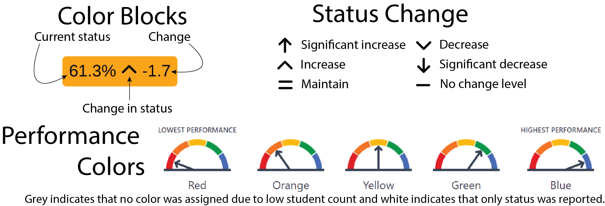

```{r setup, include = FALSE}
library(shiny)
library(tidyverse)
library(DT)
library(wesanderson)
library(fontawesome)
library(ggtext)
library(showtext)
library(formattable)
library(DT)
library(flextable)
library(here)

dashboard <- read_csv(here("data/solano_dashboard.csv")) |>
  # filter(countyname == "Solano") |>
  mutate(
    statuslevel = as_factor(statuslevel),
    reportingyear = fct_relevel(as_factor(reportingyear), "2019"),
    indicator = case_match(
      indicator,
      "ELA" ~ "ELA (DFS)",
      "Math" ~ "Math (DFS)",
      "science" ~ "Science",
      "college/career" ~ "College/\nCareer",
      .default = indicator
    ),
    indicator = fct_relevel(
      as_factor(indicator),
      "ELA (DFS)",
      "Math (DFS)",
      "ELPI",
      "absenteeism",
      "graduation",
      "suspension",
      "College/\nCareer",
      "Science"
    ),
    studentgroup = as_factor(studentgroup),
    student_group_long = fct_relevel(
      as_factor(student_group_long),
      "All students",
      "American Indian or Alaska Native",
      "Asian",
      "Black/African American",
      "Filipino",
      "Hispanic",
      "Pacific Islander",
      "White",
      "Multiple Races/Two or more",
      "Socioeconomically Disadvantaged",
      "Homeless Youth",
      "Students with Disabilities",
      "Foster Youth",
      "English Learner",
      "Long-Term English Learner",
      "English Learners Only",
      "RFEPs Only",
      "English Only",
      "Smarter Balanced Assessment",
      "CA Alternative Assessment"
    ),
    color = as_factor(color)
  )


status_colors <- c(
  "lightgrey",
  "tomato",
  "orange",
  "yellow",
  "mediumseagreen",
  "dodgerblue",
  "darkgrey"
)

font_add('fa-solid', here('fonts/fa-solid-900.ttf'))

```

{fig-align="right" width="127"}

# `r paste0(params$year, "-", parse_number(params$year) + 1, " ", params$initials, " ", if_else(params$school == "District Aggregate", "", params$school))` Dashboard Summary

## California School Dashboard `r params$year`

The `r params$year` California School Dashboard (Dashboard) reflects California's accountability system with the reporting of status (current year data), change (the difference from prior year data), and performance levels (colors) for all state indicators. Details below represent icon definitions included in the dashboard overview.

{fig-align="center" width="5.1in"}

## `r if_else(params$school == "District Aggregate", paste(params$initials, "Programs"), params$school)` Dashboard Overview `r params$year`

```{r dashboard-plot_2, echo = FALSE, warning=FALSE, fig.height = 4.8, fig.width = 8.2}
showtext_auto()

# element_markdown uses <br> for newlines
html_wrap <- function(s, width = 17) {
  str_wrap(s, width = width) |>
    str_replace_all("\n", "<br>")
}

dashboard_filtered <-
  dashboard |>
  filter(
    schoolname == params$school,
    districtname == params$district,
    reportingyear == params$year,
    (params$school == "District Aggregate" & rtype == "D") | rtype == "S",
    student_group_long %in%
      c(
        "All students",
        "American Indian or Alaska Native",
        "Asian",
        "Black/African American",
        "Filipino",
        "Hispanic",
        "Pacific Islander",
        "White",
        "Multiple Races/Two or more",
        "Socioeconomically Disadvantaged",
        "Homeless Youth",
        "Students with Disabilities",
        "Foster Youth",
        "English Learner",
        "Long-Term English Learner"
      )
  ) |>
  mutate(
    student_group_wrapped = str_wrap(student_group_long, width = 17),
    change = if_else(is.na(change), "", paste(change)),
    change_arrow = if_else(
      indicator %in%
        c(
          "ELA (DFS)",
          "Math (DFS)",
          "Science",
          "ELPI",
          "graduation",
          "College/\nCareer"
        ),
      case_match(
        changelevel,
        0 ~ "<span style='font-family:fa-solid;'>&#xf068;</span>",
        1 ~ "<span style='font-family:fa-solid;'>&#xf063;</span>",
        2 ~ "<span style='font-family:fa-solid;'>&#xf078;</span>",
        3 ~ "<span style='font-family:fa-solid;'>&#xf7a4;</span>",
        4 ~ "<span style='font-family:fa-solid;'>&#xf077;</span>",
        5 ~ "<span style='font-family:fa-solid;'>&#xf062;</span>",
        .default = "<span>&nbsp;&nbsp;&nbsp;&nbsp;&nbsp;&nbsp;&nbsp;</span>"
      ),
      case_match(
        changelevel,
        0 ~ "<span style='font-family:fa-solid;'>&#xf068;</span>",
        5 ~ "<span style='font-family:fa-solid;'>&#xf063;</span>",
        4 ~ "<span style='font-family:fa-solid;'>&#xf078;</span>",
        3 ~ "<span style='font-family:fa-solid;'>&#xf7a4;</span>",
        2 ~ "<span style='font-family:fa-solid;'>&#xf077;</span>",
        1 ~ "<span style='font-family:fa-solid;'>&#xf062;</span>",
        .default = "<span>&nbsp;&nbsp;&nbsp;&nbsp;&nbsp;&nbsp;&nbsp;</span>"
      )
    )
  ) |>
  arrange(student_group_long)

group_count <-
  dashboard_filtered |>
  select(student_group_long) |>
  unique() |>
  nrow()

da_eligible <-
  dashboard_filtered |>
  group_by(student_group_long) |>
  arrange(student_group_long) |>
  summarise(group_da_eligible = sum(priority_eligible)) |>
  mutate(
    order = c(1:group_count),
    # student_group_markdown = if_else(
    #   group_da_eligible > 0,
    #   paste(
    #     "<span style='color: darkred;face: bold'>", # Group is eligible
    #     html_wrap(student_group_long, width = 17),
    #     "</span>"
    #   ),
    #   paste(
    #     "<span style='color: black'>", # group is not eligible
    #     html_wrap(student_group_long, width = 17),
    #     "</span>"
    #   )
    # ),
    student_group_markdown = paste(
      "<span style='color: black'>", # group is not eligible
      html_wrap(student_group_long, width = 17),
      "</span>"
    ),
    student_group_markdown = fct_reorder(student_group_markdown, order)
  )

dashboard_filtered |>
  left_join(da_eligible, by = join_by(student_group_long)) |>
  ggplot() +
  geom_richtext(
    x = 0.5,
    y = 0.5,
    mapping = aes(
      label = if_else(
        indicator == "ELA (DFS)" |
          indicator == "Math (DFS)" |
          indicator == "Science" |
          is.na(currstatus),
        paste(currstatus, change_arrow, change),
        paste0(currstatus, "% ", change_arrow, " ", change)
      ),
      fill = color
    ),
    show.legend = FALSE,
    text.color = "black",
    color = "#EEEEEE",
    label.size = 0.8,
    size = 3.3
  ) +
  scale_fill_manual(values = status_colors, drop = FALSE, na.value = "white") +
  facet_grid(
    student_group_markdown ~ indicator,
    scales = "free",
    space = "free"
  ) +
  theme_minimal() +
  theme(
    text = element_text(size = 12),
    strip.text.x = element_text(size = 11),
    strip.text.y = element_markdown(
      size = 11,
      angle = 0,
      vjust = 0.7,
      hjust = 0
    ),
    strip.clip = "off",
    panel.spacing = unit(0, "pt")
  )

showtext_auto(FALSE)
```

Report prepared by Solano County Office of Education Assessment Research and Evaluation team. Email Dr. Tacey Rodgers trodgers\@solanocoe.net and Joseph Knapp jknapp\@solanocoe.net with any questions.